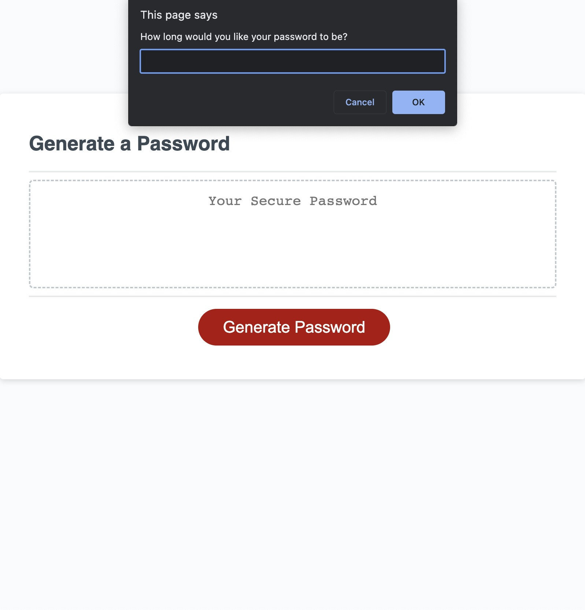
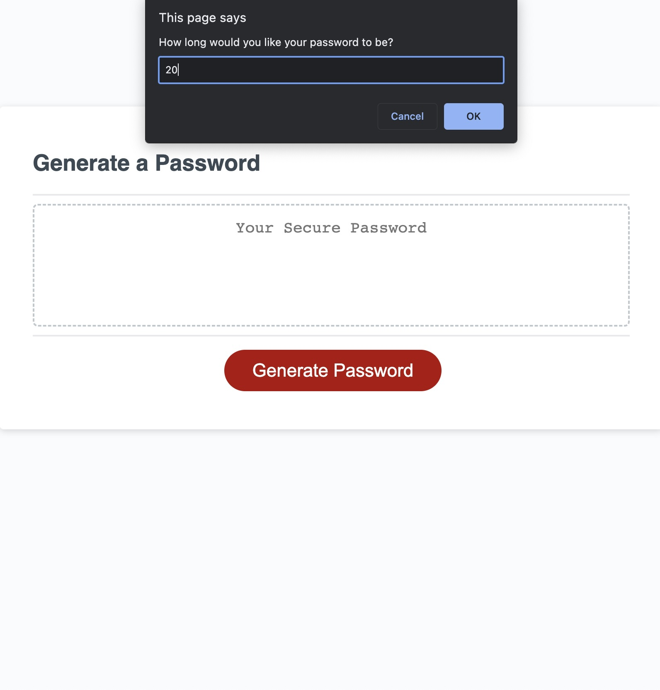
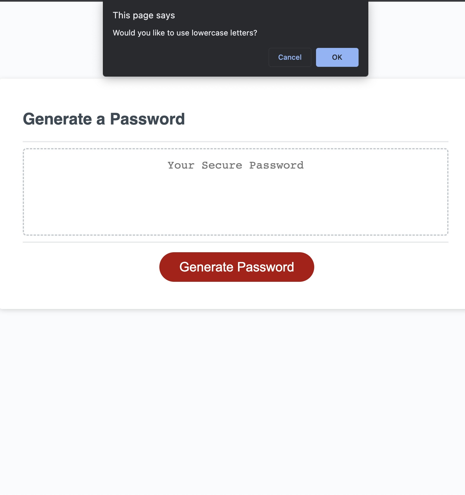
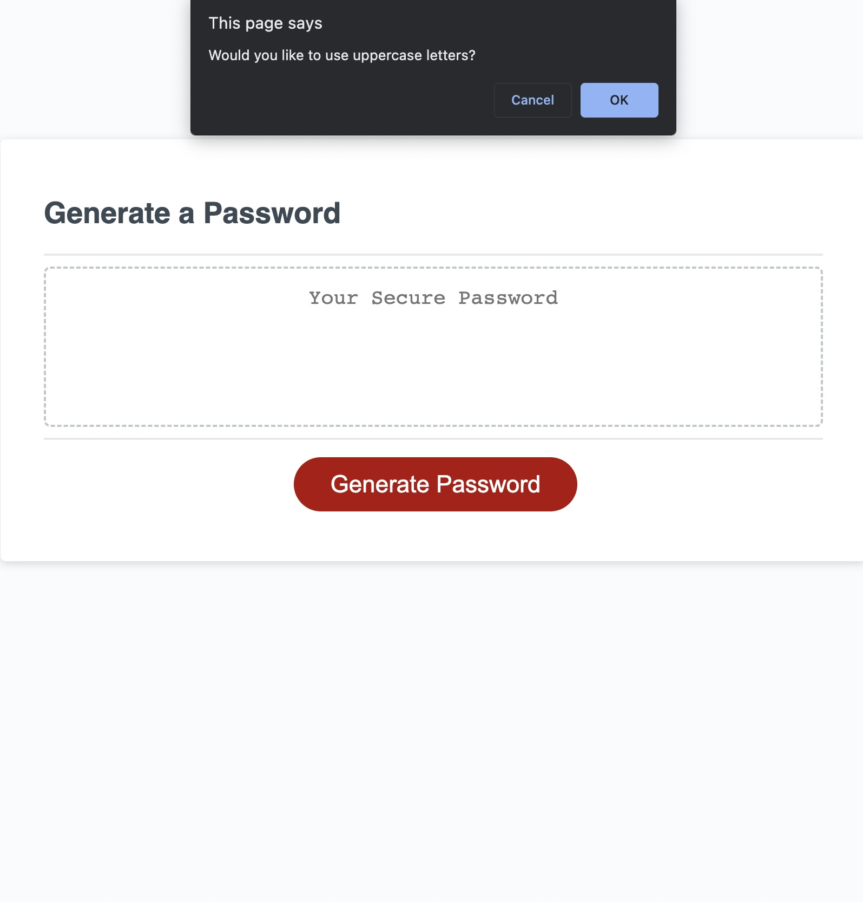
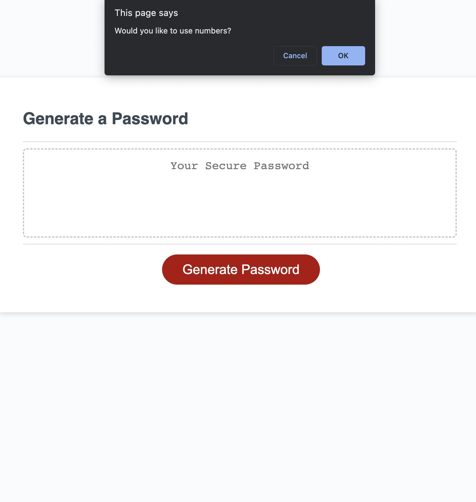

# Random Password Generator

## Description

This random Password Generator will randomly generate a password between 8 and 128 characters.  
Upon clicking generate you will be prompted to input how many characters the user would like their password to be.  
Then user will be prompted if they want to use lowercase letters,  
then user will be prompted if they want to use uppercase letters,  
then user will be prompted if they want to use numbers, and  
then user will be prompted if they want to use special characters.

If user selected yes to all the forementioned prompts, this Random Password Generator will randomly generate a password with all numbers between 0-9, letters between a-z, both lowercase and uppercase; it will also generate the following characters: !@#$%^&\* into the password and be the user selected length from prompt one.

## Code Edits to Index.html

<ul>
<li> Corrected link to script.js </li>
<li> Corrected link to style.css </li>
</ul>

## Code Added to Script.js

<ul>
<li>  </li>
<li>  </li>
<li>  </li>
<li>  </li>
<li>  </li>
<li>  </li>
<li>  </li>
<li>  </li>
<li>  </li>
</ul>

## Link to Live Site

<a href="">

## Images of Webpage and Functionality

## License

N/A
